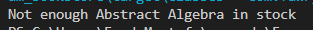

## Tested Scenarios (see `Main.java`)

### Inventory Setup:

```java
inventory.addBook(new PaperBook("P001", "Abstract Algebra", 2010, 300, 5));
inventory.addBook(new EBook("E001", "AI for Everyone", 2024, 100, "PDF"));
inventory.addBook(new ShowcaseBook("S001", "Sample Book", 2000, 0));
```

### ✅ Case 1: Successful PaperBook Purchase
4 Books is in stock and shipped successfully.

```java
try {
    double amount = inventory.buyBook("P001", 4, "example@mail.com", "Cairo, Egypt");
    System.out.println("Paid amount for paper book: " + amount);
} catch (Exception e) {
    System.out.println(e.getMessage());
}
```

### output:


---

### ❌ Case 2: PaperBook Purchase With Insufficient Stock
Tries to buy more than what's in stock.

```java
try {
  double amount = inventory.buyBook("P001", 10, "example@mail.com", "Cairo, Egypt");
  System.out.println("Paid amount for paper book: " + amount);
} catch (Exception e) {
    System.out.println(e.getMessage());
}
```
### output:


---

### ❌ Case 3: Invalid ISBN (Book Not Found)

Invalid or mistyped ISBN results in error.

```java
try {
    double amount = inventory.buyBook("E01", 1, "example@mail.com", null);
    System.out.println("Paid amount for ebook: " + amount);
} catch (Exception e) {
    System.out.println(e.getMessage());
}
```

### output:


---

### ❌ Case 4: ShowcaseBook Purchase Attempt

Trying to buy a non-purchasable ShowcaseBook results in an error.

```java
try {
    inventory.buyBook("S001", 1, "example@mail.com", "Cairo");
} catch (Exception e) {
    System.out.println("Error - " + e.getMessage());
}
```

### output:


---

### ✅ Case 5: Removing Outdated Books

Books older than 20 years are removed from the inventory.

```java
var removedBooks = inventory.removeOutDatedBooks();
for (Book b : removedBooks) {
    System.out.println("Removed outdated book - " + b.getTitle());
}
```

### output:


---